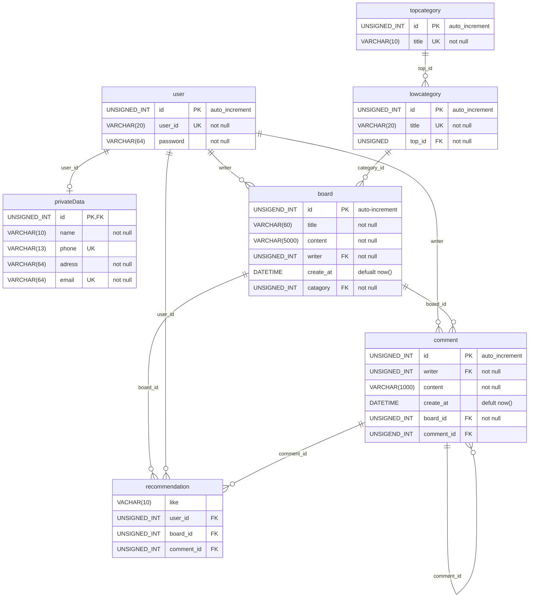

```mermaid
erDiagram
user{
    UNSIGNED_INT id PK "auto_increment"
    VARCHAR(20) user_id UK "not null"
    VARCHAR(64) password "not null"
}
privateData{
    UNSIGNED_INT id PK ,FK
    VARCHAR(10) name "not null"
    VARCHAR(13) phone UK
    VARCHAR(64) adress "not null"
    VARCHAR(64) email UK "not null"
}
board{
    UNSIGEND_INT id PK"auto-increment"
    VARCHAR(60) title "not null"
    VARCHAR(5000) content "not null"
    UNSIGNED_INT writer FK "not null"
    DATETIME create_at "defualt now()"
    UNSIGNED_INT catagory FK "not null"
}
topcategory{
    UNSIGNED_INT id PK "auto_increment"
    VARCHAR(10) title UK "not null"
}
lowcategory{
    UNSIGNED_INT id PK "auto_increment"
    VARCHAR(20) title UK "not null"
    UNSIGNED top_id FK "not null"
}
comment{
    UNSIGNED_INT id PK "auto_increment"
    UNSIGNED_INT writer FK "not null"
    VARCHAR(1000) content "not null"
    DATETIME create_at "defult now()"
    UNSIGNED_INT board_id FK "not null"
    UNSIGEND_INT comment_id FK
}

recommendation{
   VACHAR(10) like
   UNSIGNED_INT user_id FK
   UNSIGNED_INT board_id FK
   UNSIGNED_INT comment_id FK
}
user ||--o| privateData:user_id
user||--o{board:writer
topcategory||--o{lowcategory:top_id
lowcategory||--o{board:category_id
user||--o{comment:writer
board||--o{comment:board_id
comment||--o{comment:comment_id
board||--o{recommendation:board_id
user||--o{recommendation:user_id
comment||--o{recommendation:comment_id
```
