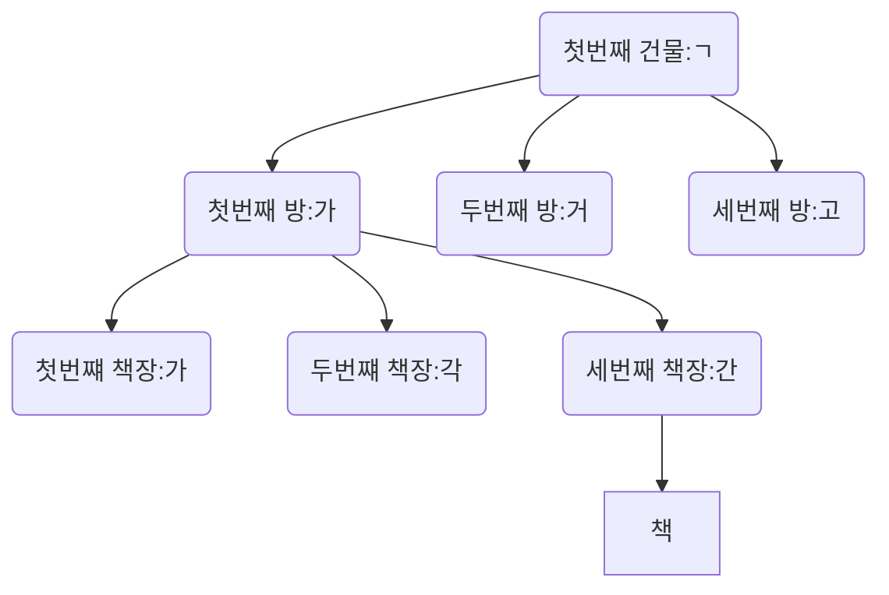

# index

## 얻을 수 있는 장점

- MySql 이 데이터를 빠르게 찾기 위해서
  - SELECT가 빨라진다.

```sql
SELECT *FROM board WHERE id=1;
```

## 단점

- SELECT 이외의 DML이 느려진다.
- 용량을 약 10% 더 먹는다.

# 색인

- 책 속의 내용 중에서 중요한 단어나 항목, 인명따위를 쉽게 찾아볼수 있도록 일정한 순서에 따라 별도로 배열하여놓은 목록

## index를 설정하면

- 설정에 맞춰서 목록을 생성

## 왜 사용할까?

- 왜 빨리 찾아야 할까?
  | num | name |
  | --- | ------ |
  | 1 | 김강문 |
  | 2 | 박성민 |
  | 3 | 방지환 |

# index를 자동으로 해주는 키

- UNIQUE
- PRIMARY KEY
- FOREING KEY

# index는 어떨게 빠르게 찾을 수 있는가? 목록화를 어떻게 하는가?

## 자료구조

- 순서대로 정리한다.
- 가나다 순으로 책을 정리한다.
  - 첫번쨰 건물 : ㄱ => 100만권
  - 첫번쨰 방 : 가
    - 첫밴쨰 책장 : 가
    - 두번쨰 책장 : 각
    - 세번쨰 책장 : 간
  - 두번쨰 방 : 거
  - 세번쨰 방 : 고
  - 두번쨰 건물: ㄴ

### B_Tree



# index test

```sql
CREATE TABLE board(
 id INT UNSIGNED PRIMARY KEY AUTO_INCREMENT,
 title VARCHAR(20) NOT NULL,
 create_at DATETIME DEFAULT NOW(),
 writer INT UNSIGNED,
 content VARCHAR(10000) NOT NULL,
 FOREIGN KEY (writer) REFERENCES user(id)
 ON UPDATE CASCADE
 ON DELETE SET NULL
);
```

## CREATE INDEX

```sql
CREATE INDEX idx_board_title ON board_test(title ASC)
```

- ASC : 오름차순
- DESC : 내림차순

## SHOW INDEX

```sql
SHOW INDEX FROM board_test;
```

## DROP INDEX

```sql
DROP INDEX idx_board_title ON board_test
```
