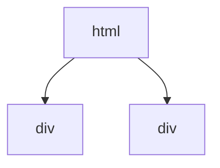

# DBMS

- DataBase MAnagement System
- 데이터베이스 필수적인자료관리시스템

# DataBase

- 데이터를 저장하는 곳?
- 파일
- Data+Base, 데이터의 기초가 되는것
- 컴퓨터가 없다. 무엇을 기억해야한다면
  -> 종이->보관(서랍장등)

- 컴퓨터가 보급되지 않았을때 -> 문서 작성해서 문서함에 저장
  ->회사의 사람에대한 이력서 회사내 문서 등, 필수적인자료 등
  - 문서 == 데이터 베이스
  - 관리자 ==DBMS
  - 어떤문서가 필요하다 -> 관리자에게 요청 -> 찾아다줌
  - 우리가 구글 드라이브나 아이클라우드 같은 돗에 저장된 문서, 사진 ,동영상등등의 파일 == 데이터 -> 정리한 폴더들은 == 데이터베이스
    ->크롬 등의 브라우저로 접속해서 해당파일들을 이동 업로드 수정 등등을 진행 -> 웹페이지 ==DBMS
  - 데이터들을 효과적으로 관리하지 못한다
  - 용량이나 위치 등을 적절하게 조절하지 못한다.
  - 메모리 단위까지 계산해서 데이터들을 정리하기 시작했다 => 데이터 베이스
  - 이미지 등 파일들 봤을떄 데이터라고 볼수 있는가?
    => 데이터 베이스에서 얘기하는 데이터란 무엇일까?
    --> 짤막한 정보들
    ex) - 박성민 /34/남자/대한문국/학생/군필 등등 <<단순 정보
    데이터=> 정리가 가능하고 다른 객체들과 공통되게 사용할수 있는것들

# DBMS(DataBase)의 특징

- 보안 << 계정에대한 권한을 다양하게 설정할수있다.
- 데이터의 일관성

```javascript
let a = 1;
a = "2";
```

- 특정한 데이터에 대해서 형식들을 고정시킬수 있다.
- 그럼으로써 정확성을 높일 수 있다.
- 성능 최적화 << 캐시 등의 기술로 성능을 높인다.
- 데이터의 중앙화 & 공유
- 백업 & 복구

# DBMS 종류

## 망형 DBMS

- 지금은 안쓰인다.
- WWW(wor
  ld wide web)
- 거미줄

## 계층형 DBMS

- 지금은 안쓰인다.
- 화사의 직급 -> ex)HTML 구조

```
<html>
    <div></div>
    <div></div>
</html>
```



## 관계형 DBMS => RDBMS

- Relation DAtaBase Management System
- mySQL, Oracle DB
- table, 표로 정리한다.
- 각 테이블이 서로 간에 관계 시스템을 맺어 서로를 찾거나 수정할 수 있다.

  | id  |  이름  | 형제 |
  | :-: | :----: | :--: |
  |  1  | 이승배 |  2   |
  |  2  | 이정배 |  1   |
  |  3  | 박성민 |      |
  |  4  | 박지완 |      |
  |  5  | 김강문 |      |
  |  6  | 이동찬 |      |
  |  7  | 손민복 |      |

- SQL을 사용한다.

## noSQL DBMS

- SQL을 사용하지않는다.
- 비관계형 DB
- table에 맞추지 않아도 된다. -유연한 형태의 스키마를 가진다.
- Mongo DB, Resis

## RDBMS VS noSQL

|        RDBMS         |       비교       |    noSQL     |
| :------------------: | :--------------: | :----------: |
|        table         | 데이터 정리 방식 | object(JSON) |
|         높음         |  정확도&안정성   |     낮음     |
|         느림         |       속도       |     빠름     |
| 정리가 필요한 데이터 |     주사용처     |     log      |
|                      |                  |              |

# 설치

- ubuntu 에서

```bash
sudo apt-get update
sudo apt-get upgrade
sudo apt-get install mysql-server -y
```

- mac의 terminal 에서

```bash
brew update
brew upgrade
sudo install mysql
```

# 상태확인

- ubuntu 에서

```bash
sudo service mysql start
```

- mac의 terminal 에서

```bash
mysql.server start
```

# mysql 기본설정

```bash
mysql_secure_installation
```

# mysql 접속

```bash
mysql -u root -p
```

유저 이름 패스워드 입력

# root 계정의 비밀번호 변경

- ubunto 에서

```bash
ALTER USER 'root'@'localhost'
IDENTIFIED WITH mysql_native_password
BY '1234qwer'
```

-mac의 turminal에서

```bash
ALTER USER 'root'@'localhost'
IDENTIFIED BY '1234qwer'

```

# mysql 종료

```bash
exit
```

# UbuntuRoot

# 상태확인

- ubuntu 에서

```bash
sudo service mysql start
```

- mac의 terminal 에서

```bash
mysql.server start
```
