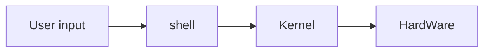

## Ubuntu

-Linux 기반 os

- Unix 계열
- 오픈 소스
- Command Line Interface 환경
- Gui와 대비
- 명령어로 프로그램 실행

## 구조



## 설치

-WSL 설치

- Linux용 Windows 하위 시스템
  - Windows SuvSystem Linux
- Hyper-V
  - 가상 머신 플랫폼

## vi

```bash
vi test, txt
```

- 메모장
- 아래의 현재 모드에 대해서 적혀있다,

- `i`를 누르면 `--insert--`로 바뀌고 입력모드.
- `esc` 누르면 비어지며 통상 모드
  - 통상 모드시 저장, 종료 가능
- `:`를 누르면 파일의 저장|종료 등 명령어를 입력할수 있다. - - - `:q` :종료
- `:w`:쓰기
- `:wq`:쓰고 종료
- `!`: 강제 << 관리자 권한으로 실행
- `:wq!` 강제로 저장하고 종료한다.
- `:q!`:강제로 종료한다<< 수정후 수정사항 날릴떄

## vim

-메모장

# NginX

- 설치

```shell
sudo apt-get update
sudo apt-get upgrade
sudo apt-get install nginx
```

- 확인

```shell
sudo service nginx status
sudo service nginx start
```

##
